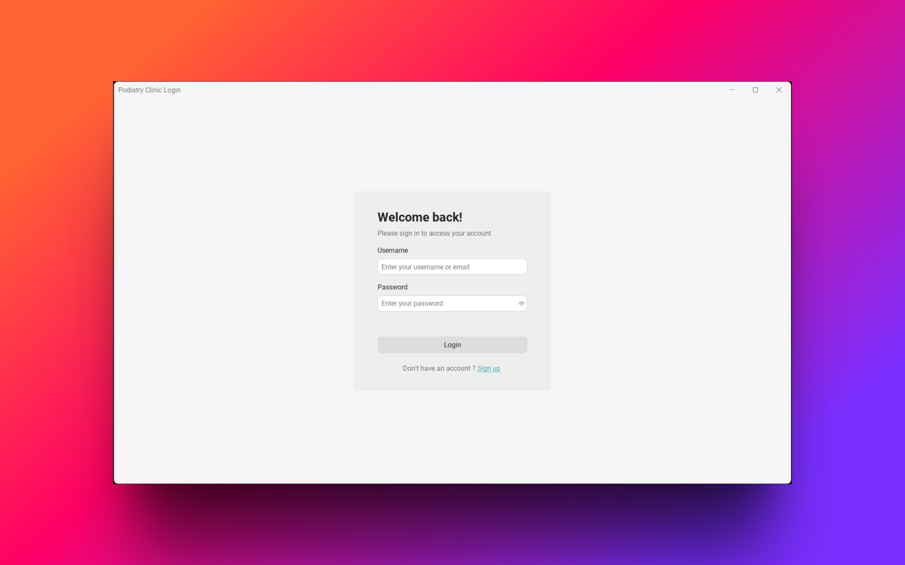
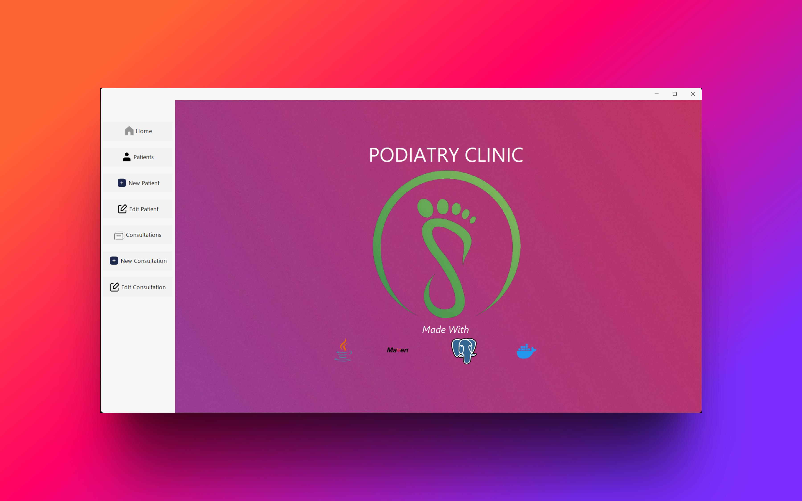
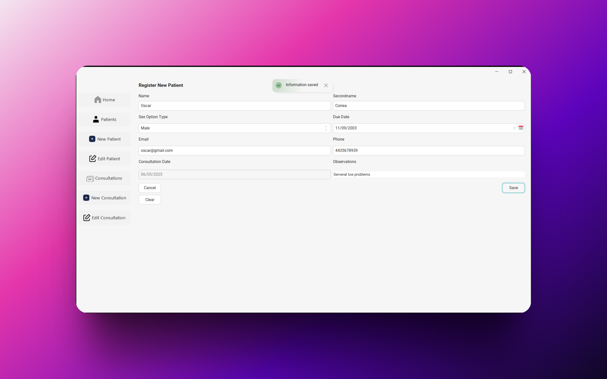
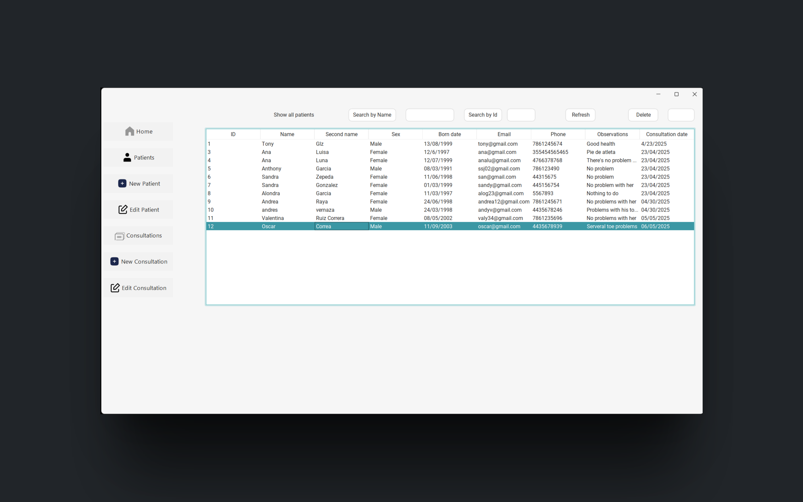
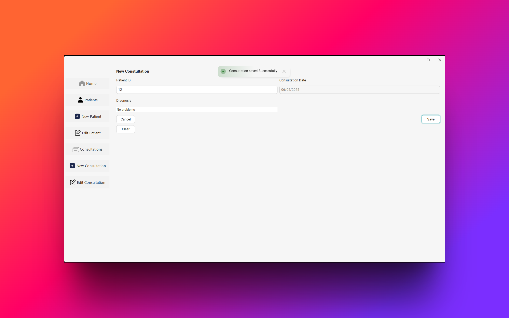
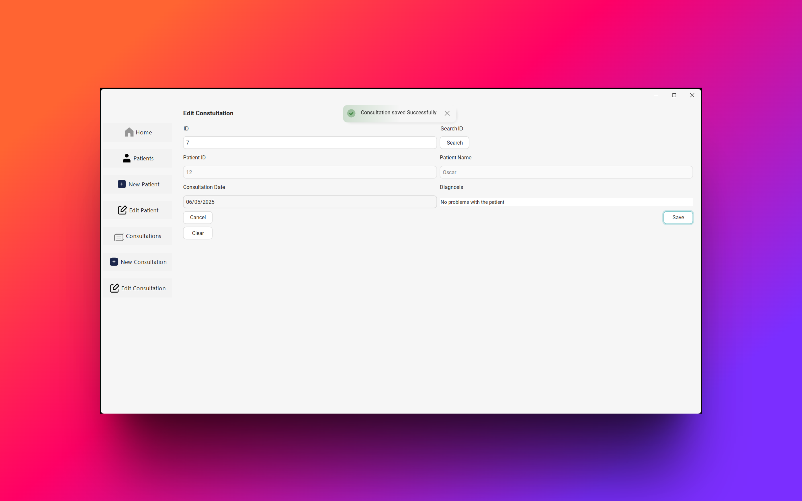
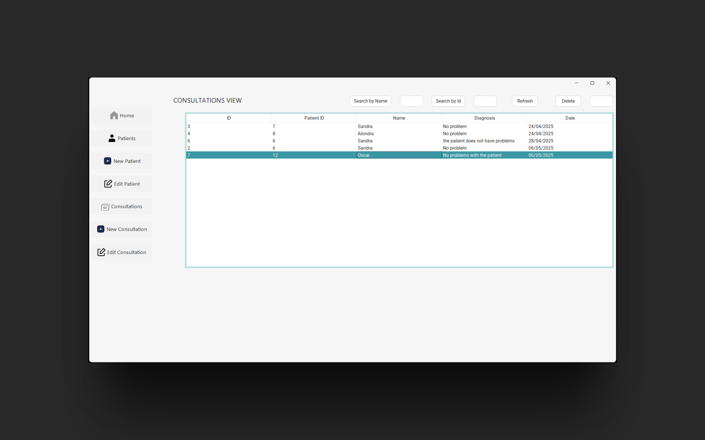

# 📌 Overview


UPDATED PROJECT USING NEW TECHNOLOGIES
Patient management and tracking system for a podiatry clinic
Originally developed by a team of four computer systems engineering students including me using MySQL and Java Wwing. Updated to new technologies by me.
You cand find the original project developed at: [JavaControlPacientes](https://github.com/rawrfox/ControlPacientesJava)

<br><br>


<h2>Login </h2>


<br>
<h2>Home </h2>


<br>
<h2>Add Patient </h2>


<br>
<h2>Patients </h2>


<br>
<h2>Add Consultation </h2>

<br>

<h2>Edit Consultation </h2>


<br>
<h2>Consultations </h2>



## 🛠️ Stack

- [Java 17 - Microsoft OpenJDK:](https://learn.microsoft.com/en-us/java/openjdk/download#openjdk-17) An official distribution of Java 17 provided by Microsoft, compatible with the latest language features and libraries.
- [Java Swing](https://docs.oracle.com/javase/7/docs/api/javax/swing/package-summary.html) A Java framework for creating graphical user interfaces (GUIs) with components like buttons, panels, and text fields.
- [Java Persistence API](https://www.ibm.com/docs/es/was-liberty/nd?topic=liberty-java-persistence-*api-jpa) A standard Java API for interacting with relational databases, making it easier to map Java objects to database tables.
- [Swing Toast Notifications](https://github.com/DJ-Raven/swing-toast-notifications) A library for showing "toast" notifications (pop-up messages) in Java Swing applications.
- [Flatlaf]( https://github.com/JFormDesigner/FlatLaf) A lightweight and modern theme for Java Swing applications, providing a flat design that resembles modern operating system interfaces.
- [DatePicker](https://github.com/DJ-Raven/swing-datetime-picker) A component for selecting dates in a simple and visual way in Java Swing applications, based on a calendar control.
- [PostgreSQL](https://hub.docker.com/_/postgres) An open-source relational database management system known for its robustness and advanced transaction support.
- [Docker](https://www.docker.com/) A container platform that allows you to package, distribute, and run applications in isolated environments across any platform.
- [svgrepo](https://www.svgrepo.com/) A repository of free SVG icons, useful for visual designs in web or desktop applications.

## 🚀 Run application

1. Install maven & OpenJDK17.
2. Clone the repository.
3. For Mac and Linux (using bash):
```bash
mvn install:install-file \
  -Dfile=INSERTYOURPROYECTPATH/lib/swing-toast-notifications-1.0.4.jar \
  -DgroupId=raven.toast \
  -DartifactId=swing-toast-notifications \
  -Dversion=1.0.4 \
  -Dpackaging=jar
```

For Windows (using Command Prompt or PowerShell):
In Command Prompt:
```shell
mvn install:install-file ^
  -Dfile=INSERTYOURPROYECTPATH\lib\swing-toast-notifications-1.0.4.jar ^
  -DgroupId=raven.toast ^
  -DartifactId=swing-toast-notifications ^
  -Dversion=1.0.4 ^
  -Dpackaging=jar
```

Powershell:
```powershell
mvn install:install-file `
  -Dfile=INSERTYOURPROYECTPATH\lib\swing-toast-notifications-1.0.4.jar `
  -DgroupId=raven.toast `
  -DartifactId=swing-toast-notifications `
  -Dversion=1.0.4 `
  -Dpackaging=jar
```

4. Run `docker compose up` on your terminal.
5. Import and Initialize the project on your preference Java IDE.


## 📁 Project Structure
```
.
├── docker-compose.yml
├── initdb
│   └── podiatrydatabase.sql       # Database initalization script
├── postgres/                      # database PostgreSQL automatically created
├── src
│   ├── main
│   │   ├── java
│   │   │   └── mx.tecnm.cdhidalgo.podiatryclinic
│   │   │       ├── gui
│   │   │       ├── logic
│   │   │       ├── persistence
│   │   │       └── icon / resources
│   │   └── resources
│   └── test
│       └── java
└── target/       
```


